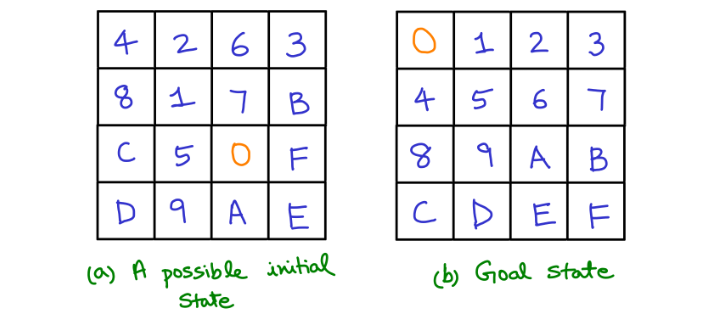

# 16-Puzzle Problem

Problem Statement: The figure below shows the 15-puzzle problem. The square marked as 0 is the empty space. The remaining characters (i.e. 1 to F) represent the 15 blocks that can be slided into the empty space if they are adjacent. You can assume that the initial state is such that it is possible to reach the Goal state shown below. The possible actions are Up, Down, Left and Right.

